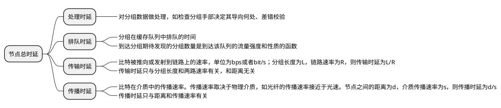
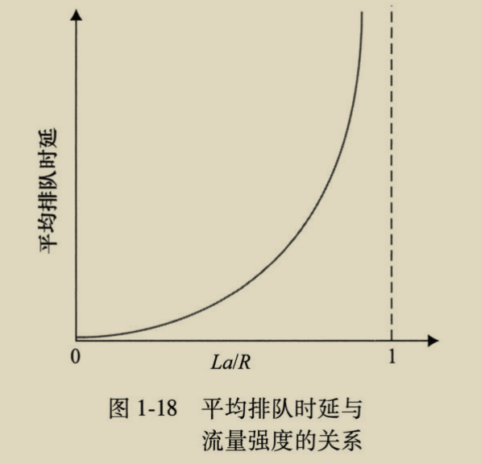
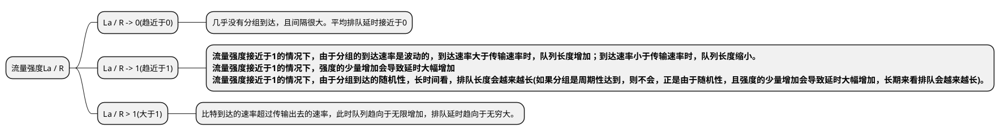

# 分组交换中的时延、丢包和吞吐量

## 节点时延分类

节点总时延: $d_{nodal}$  
节点处理时延: $d_{proc}$  
排队时延: $d_{queue}$  
传输时延: $d_{trans}$  
传播时延: $d_{prop}$  

$d_{nodal} = d_{proc} + d_{queue} + d_{trans} + d_{prop}$

## 排队时延

* 流量的性质  
指流量是周期性到达还是突发性到达。

* 流量强度  
若分组的长度为L bit，分组到达队列的平均速率为a pkt/s(分组每秒)，节点的传输速率为R bit/s，则La/R称为流量强度。  

{width="400"}

## 丢包

流量强度接近于1时，排队时延不会无限增加，当队列已满时，分组会被丢弃。

一个节点的性能不仅看时延，还要看丢包的概率。

## 端到端时延

假设：
* 源主机和目的主机之间有N条链路即N-1台路由器，
* 网络无拥塞，即节点无排队时延，
* 每台主机和路由器的处理时延都为 $d_{proc}$，
* 每个节点输出速率都为R bps，分组长度为L bit，即传输时延$d_{trans} = L / R$，
* 链路的传播时延都为 $d_{prop}$

则：端到端延时$d_{end-end} = N(d_{proc} + d_{trans} + d_{prop})$

### Traceroute

路由追踪软件(windows下为tracert)，采用ICMP协议

### 端系统时延

端系统除了处理时延、传输时延和传播时延外，还有一些其他时延（应用程序刻意或者某些协议的时延）

## 计算机网络中的吞吐量

多条链路组成的网络，最慢的链路称**瓶颈链路**。  
假设服务器和客户端之间具有N条链路的网络，这N条链路的传输速率分别是R1，R2...Rn，则服务器到客户端的吞吐量为min{R1, R2...Rn}  

因特网中核心的公共链路本身传输速率很大，但是由于其是共享的，所以速率会被稀释(TCP协议会平分速率)。
