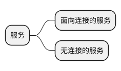
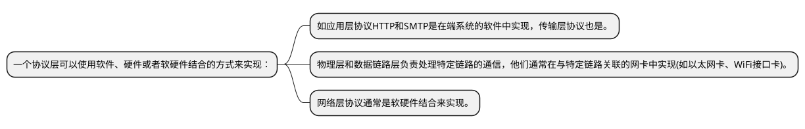
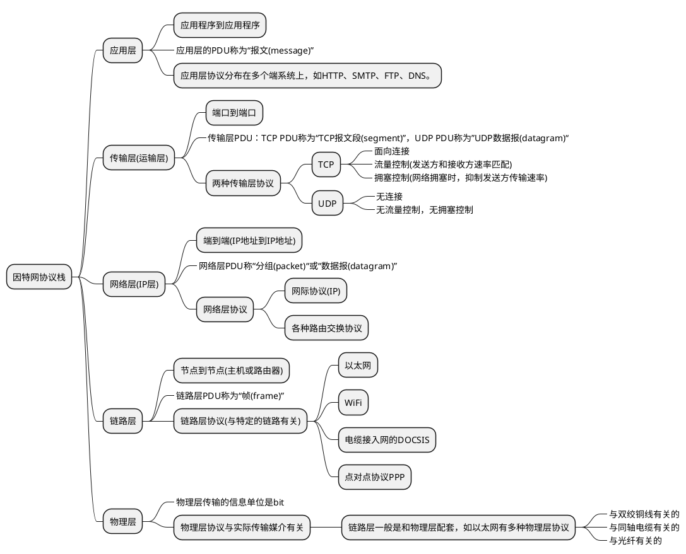

# 协议层次及服务模型

* 服务(Service)  
低层实体向上层实体提供它们之间的通信的能力；  
底层实体为服务提供者，上层实体为服务用户  
底层实体通过服务访问点(SAP)来区分不同的上层服务用户

* 原语(primitive)  
上层使用下层服务的具体形式。服务原语即是服务中的不可分割的原子操作，比如应用层（N+1层）通过传输层（N层）的 CONNECT.request 原语请求建立连接

* SAP(Service Access Point，服务访问点)  
 SAP是N层实体向N+1层实体提供服务的逻辑接口，相当于上下层之间的“桥梁”。  
 如传输层给应用层提供的**端口**；网络层给传输层提供的**IP地址**。  

* 协议(protocol)  
对等层实体(peer entity)之间在相互 通信的过程中，需要遵循的规则的集合

* SDU(Service Data Unit, 服务数据单元)  
  由上一层传递到本层还未被处理的数据

* PDU(Protocol Data Unit，协议数据单元)  
将本层SDU经过特定格式处理后将传递到下一层的数据  
第N层PDU = 第N层头部 + 第N层SDU(即第N+1层PDU)

## 协议分层
网络协议以分层的方式来组织。各层的所有协议称为协议栈。

协议层次中，下层给上层提供服务(提供接口)，上层使用下层提供的服务(使用接口)。

协议分层的缺点：
* 不同层可能有功能冗余。如多个层都有差错恢复。
* 某层的功能可能需要其它层才有的信息(如：时间戳)，这违反了层次分离的目的。

## 封装

下层接收上层的分组，并添加附加信息，组成本层的分组，称为封装。

每一层的分组具有两个类型的字段：首部和有效载荷(payload)，有效载荷来自上一层。