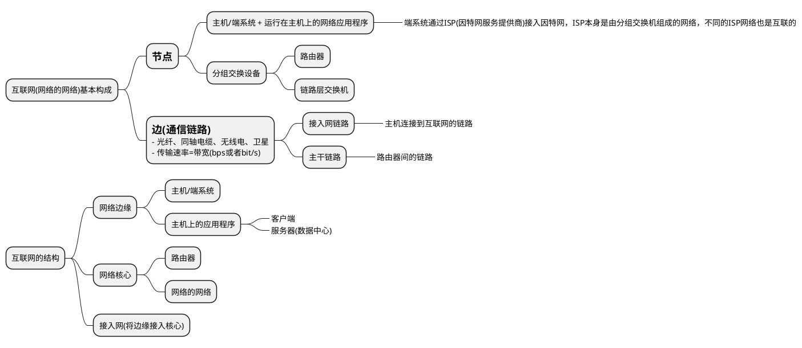

# 因特网

## 构成

* ISP  
互联网服务提供商，如电信、联通
* ICP  
互联网内容提供商，如百度、谷歌、网易

## 服务
网络应用涉及到多个相互交换数据的端系统，故称它们为分布式应用。从这个角度，因特网即是分布式应用和为分布式应用提供通信服务的基础设施。  

套接字接口：端系统给其之上的应用程序提供套接字接口，套接字接口规定了端系统上的程序使用因特网发送数据的方式。

## 协议
协议即对等层通信实体在通信过程中遵守的规则集合  
协议规定了通信实体之间交换的报文格式（语法、语义）、报文次序及采取的动作

* PDU(Protocol Data Unit, 协议数据单元)  
比如传输层称segment