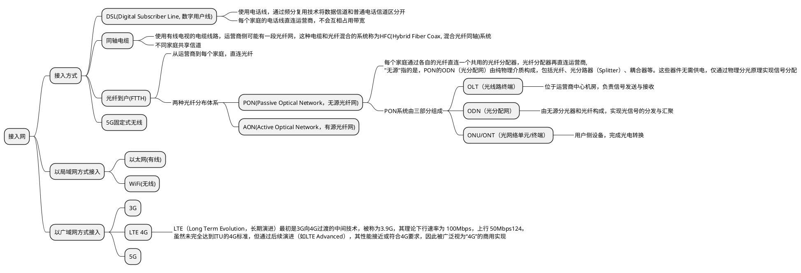
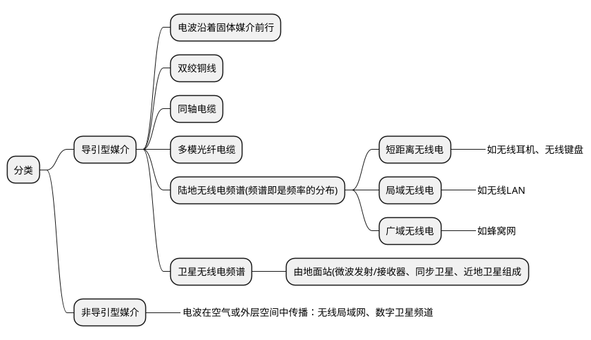

# 接入网

* 边缘路由器  
  端系统到其它端系统路劲上的第一台路由器

```plantuml
@startmindmap
* 接入网
** 接入方式

*** DSL(Digital Subscriber Line, 数字用户线)
****_ 使用电话线，通过频分复用技术将数据信道和普通电话信道区分开
****_ 每个家庭的电话线直连运营商，不会互相占用带宽

*** 同轴电缆
****_ 使用有线电视的电缆线路，运营商侧可能有一段光纤网，这种电缆和光纤混合的系统称为HFC(Hybrid Fiber Coax, 混合光纤同轴)系统
****_ 不同家庭共享信道

*** 光纤到户(FTTH)
****_ 从运营商到每个家庭，直连光纤
****_ 两种光纤分布体系
***** PON(Passive Optical Network，无源光纤网)
******_:\
每个家庭通过各自的光纤直连一个共用的光纤分配器，光纤分配器再直连运营商,
"无源"指的是，PON的ODN（光分配网）由纯物理介质构成，包括光纤、光分路器（Splitter）、耦合器等。这些器件无需供电，仅通过物理分光原理实现信号分配;
******_ PON系统由三部分组成
******* OLT（光线路终端）
********_ 位于运营商中心机房，负责信号发送与接收
******* ODN（光分配网）
********_ 由无源分光器和光纤构成，实现光信号的分发与汇聚
******* ONU/ONT（光网络单元/终端）
********_ 用户侧设备，完成光电转换

***** AON(Active Optical Network，有源光纤网)

*** 5G固定式无线

** 以局域网方式接入
*** 以太网(有线)
*** WiFi(无线)

** 以广域网方式接入
*** 3G
*** LTE 4G
****_:\
LTE（Long Term Evolution，长期演进）最初是3G向4G过渡的中间技术，被称为3.9G，其理论下行速率为 100Mbps，上行 50Mbps124。
虽然未完全达到ITU的4G标准，但通过后续演进（如LTE Advanced），其性能接近或符合4G要求，因此被广泛视为“4G”的商用实现;
*** 5G
@endmindmap
```

# 物理媒介

```plantuml
@startmindmap
* 分类
** 导引型媒介
*** 电波沿着固体媒介前行
*** 双绞铜线
*** 同轴电缆
*** 多模光纤电缆
*** 陆地无线电频谱(频谱即是频率的分布)
**** 短距离无线电
*****_ 如无线耳机、无线键盘
**** 局域无线电
*****_ 如无线LAN
**** 广域无线电
*****_ 如蜂窝网
*** 卫星无线电频谱
**** 由地面站(微波发射/接收器、同步卫星、近地卫星组成
** 非导引型媒介
***_ 电波在空气或外层空间中传播：无线局域网、数字卫星频道
@endmindmap
```
