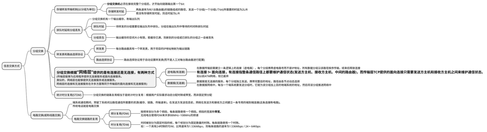
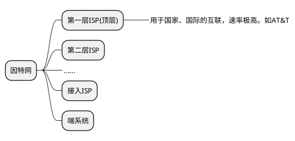

# 网络核心

* 网络核心：由分组交换设备和链路组成的网络
* 报文：端系统之间交互的数据称报文
* 分组：报文会被划分为较小的数据块，称分组

每个分组都通过链路和分组交换机进行传输。  
**分组交换机**主要有路由器、链路层交换机两类。

## 信息交换方式

## 因特网ISP分层

* 上下层互联  
上层ISP是下层ISP的提供商，下层ISP是上层ISP的客户。下层ISP需要给上层ISP付费。  
下层ISP通过上层ISP提供的PoP(Point Of Presence, 接入点)来接入。PoP是提供商网络中的一台路由器或路由器群。  
下层ISP可以同时接入多个不同的ISP的PoP，称为多宿(multi-home)。  

* 对等层互联  
同层级的ISP之间的关系是对等(peer)，对等的ISP之间可以直接连接，也可以通过汇总接入第三方公司创建的IXP(Internet Exchange Point, 因特网交换点)来实现对等。  
一般对等的ISP之间可以互相不付费。  

* 内容提供商  
内容提供商(如谷歌)，可能在全球不同的地区部署不同的数据中心，这些数据中心通过企业内部专线来互联。  
它们接入互联网的方式更倾向于与低层ISP对等接入，这样可以绕过高层的ISP(也有一些接入ISP必须通过高层ISP才能访问)，减少向高层ISP付费。  