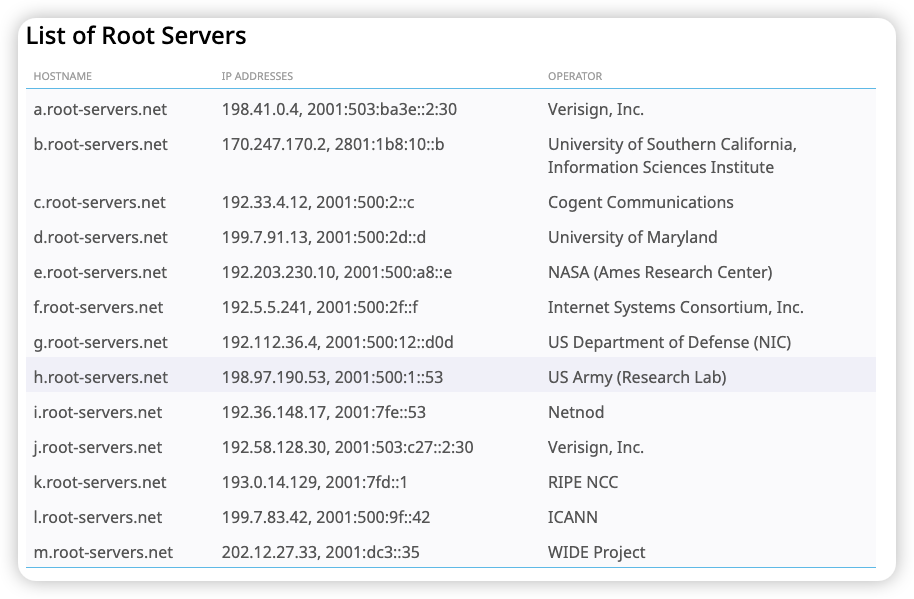

# DNS(Domain Name System, 域名系统)

```plantuml
@startmindmap
!include ../resources/mindmap_style.puml
* 因特网主机的标识方法
** 主机名(hostname)/域名
*** 域名的命名
****_:\
域名采用分层的方式命名，这样可以减少名字冲突
Internet被划分为几百个顶级域(top level domains)，顶级域分为一般顶级域(如.com, .edu)和国家顶级域(如.cn, .us, .nl, .jp),
每个(子)域下划分多个子域，树叶是主机。
如：www.google.com、gaia.cs.umass.edu;
***** 域的域名
******_ 用于表示一个域
***** 主机的域名
******_ 用于表示一个域上的主机
*** 创建一个新的域，必须征得它所属域的同意。
*** 域的划分是逻辑的，与物理网络无关
****_:\
一个域上的主机可以不在一个网络
一个网络里的主机可以不在一个域;
** IP地址
***_ IPv4地址由4个字节组成，每个字节被句点隔开。每个字节表示了0-255的数字
***_ IP地址具有层次结构。从左往右会得到越来越具体的主机位置。
@endmindmap
```

## DNS提供的服务 {id="DNS_Service"}

DNS通常由其他应用层协议使用，如HTTP、SMTP。

```plantuml
@startmindmap
!include ../resources/mindmap_style.puml
* DNS的功能
** 提供主机名到IP转换的目录服务
** 主机别名(host aliasing)
***_ 主机可以拥有多个主机别名，原主机名叫做**规范主机名**。
** 邮件服务器别名(mail server aliasing)
***_ 类似于主机别名
*** **MX记录**允许一个公司的邮件服务器和Web服务器使用相同的主机名
** 负载分配(load distribution)
***_:\
冗余的多台服务器可以有相同的主机名，对应着多个不同的IP地址。

DNS数据库中存储着主机名到IP地址集合的映射。DNS服务器会在响应中将IP地址集合返回给客户端。;
@endmindmap
```

## DNS的工作原理 {id="DNS_principle"}

DNS是一个由**分层**的DNS服务器实现的**分布式数据库**。 DNS是是一个用于主机查询分布式数据库的应用层协议。
DNS协议运行在**UDP**之上。端口号为**53**.  

DNS服务器上通常运行**BIND**(Berkeley Internet Name Domain)系统。  
DNS的BIND（Berkeley Internet Name Domain）是一款开源的域名系统（DNS）服务器软件，由美国加州大学伯克利分校开发，现由互联网系统协会（ISC）维护。它是全球使用最广泛的DNS服务器解决方案，负责将域名（如example.com）解析为计算机可识别的IP地址。

### 分布式、分层的数据库

#### - DNS服务器 {id="DNS_server"}
DNS由大量的分层的、分布在全世界的DNS服务器组成。  


```plantuml
@startmindmap
!include ../resources/mindmap_style.puml
* 分层次的DNS服务器
** 根DNS服务器
***:\
==根服务器提供TLD服务器的IP地址。

全世界有超过1000台根DNS服务器实体。这些根服务器是13个不同的根服务器的副本。
这13个根服务器由12个不同的组织来管理，并通过**因特网号码分配机构(IANA)**来协调。
中国无主根服务器管理权，但部署了F/I/J根的镜像节点（北京/上海/广州）提升区域解析效率。;
** 顶级域名(TLD, Top-Level Domain)DNS服务器
***_ 一般顶级域名(如com、org、net、edu和gov)和国家顶级域名(如uk、fr、ca、jp和cn)都有TLD服务器。
** 权威DNS服务器
***_ 组织机构的DNS服务器，提供组织机构内服务器的可访问主机的域名解析服务
*** 两种实现方法
**** 机构自己实现权威DNS服务器
**** 支付费用给域名服务提供商
** 本地DNS服务器(local DNS server)
***:\
ISP一般都有对应的本地DNS服务器，如学校ISP、机构ISP等。

本地DNS服务器IP一般通过DHCP来分配，本地DNS服务器一般和主机相隔很近，甚至在同一局域网。

家庭局域网一般通过DHCP自动设置DNS服务器为路由器的地址;
@endmindmap
```


[13个根服务器](https://www.iana.org/domains/root/servers)：  




#### - DNS查询过程 {id="DNS_query"}

```plantuml
@startmindmap
!include ../resources/mindmap_style.puml
* DNS查询
** 递归查询(以主机自己的名义查询)
** 迭代查询(直接返回给本地DNS服务器) 
@endmindmap
```

理论上DNS查询可以是递归也可以是迭代，现实中，往往采用第一张图中的混用模式。  

①是递归查询,②④⑥时迭代查询：


全部是递归查询：


#### - DNS缓存 {id="DNS_cache"}

DNS服务器接收到DNS响应后，它能将映射缓存到本地。  

主机名和IP地址的映射并不是永久的，DNS缓存会在一段时间(一般为两天)后被丢弃。  

#### - 新域名注册

* **注册商/注册登记机构（Registrar）**  
**注册商**是一个商业实体，它验证域名的唯一性，面向用户销售域名，并代理向**注册局**提交注册请求，如阿里云万网、腾讯云。  
1999年前只有一个注册商Network Solutions，它独家经营着对com、net和org域名的注册。现在有多个注册登记机构。  

* **注册局（Registry）**  
顶级域名托管商，管理TLD服务器（如 .com、.cn），维护所有二级域名的注册信息。  
.cn域名的注册局就是中国互联网络信息中心（CNNIC）。  
.com、.net 、.name、.gov等域名的注册局是美国的 Verisign 公司。  

* **ICANN（Internet Corporation for Assigned Names And Numbers, 因特网名字和地址分配机构）**  
ICANN对注册商授权，注册商对ICANN付费。  
ICANN负责协调全球域名系统，制定政策，授权TLD注册局（如Verisign管理 .com）和认证注册商（如阿里云）。  
[ICANN网站](http://www.internic.net)可以找到所有授权的注册商  

* **IANA（互联网数字分配机构）/  PTI（公共技术标识符机构）**  
IANA是ICANN的下属执行机构，ICANN是政策制定者，IANA是技术执行者，IANA现在已更名为PTI。  
IANA在域名管理中的作用是维护**DNS根区文件**，协调[13个**根服务器**](https://www.iana.org/domains/root/servers)(由12个不同的组织来管理)。  
有些机构即是根服务器管理者又是注册局，如Verisign.  
中国无主根服务器管理权，但部署了F/I/J根的镜像节点（北京/上海/广州）提升区域解析效率。  

* **根区文件(Root Zone File)**  
根区文件是存储在DNS**根服务器**上的数据文件，包含所有顶级域名（如.com、.cn、.org等）的注册局服务器地址（NS记录）及对应的IP地址（A/AAAA记录）  
[根区文件可在iana网站上查得](https://www.iana.org/domains/root/files)  

* **CNNIC（中国互联网络信息中心）**  
.cn域名的注册局  
CNNIC即是cn域名的注册局又是根镜像服务器的管理者


注册域名过程：  
1. 用户向注册商提供权威DNS服务器名和IP
2. 注册商向注册局申请域名(EPP协议)
3. 注册局同步信息至ICANN根区  
   注册局定期将新增域名的NS记录同步至ICANN管理的根区文件（Root Zone Database）。该文件包含所有TLD的权威服务器地址。
4. 根服务器同步根区文件  
   ICANN将签名的根区文件分发至全球13组根服务器运营商（如Verisign、ICANN自身等）

## DNS记录和报文 {id="DNS_record_message"}

### DNS记录 {id="DNS_record"}
DNS服务器中存储了资源记录(RR, Resource Record)，RR提供了主机名到IP地址的映射。  
每个DNS响应报文中包含了RR。  

RR是一个5字段元组：(Name, Value, Type, TTL, Class)  

| Name |       Value       |  Type   |               TTL               |       Class        |
|------|:-----------------:|:-------:|:-------------------------------:|:------------------:|
| 域名   | 值：可以是数字、域名或ASCII串 | 资源记录的类型 | 生存时间：<br/>时间无限表示是权威记录，有限表示是缓冲记录 | 类别：对于Internet，值为IN |

Name和Value的意义取决于Type，TTL表示该记录的生存时间。  

```plantuml
@startmindmap
!include ../resources/mindmap_style.puml
* DNS资源记录类型
** Type == A
***_ Name是主机名，Value是IPv4地址，如：(relay.bar.foo.com, 145.37.93.126, A)
** Type == AAAA
***_ Name是主机名，Value是IPv6地址
** Type == NS
***_:\
Name是域，Value是权威DNS服务器的主机名，如：(foo.com, dns.foo.com, NS)

一条NS记录会伴随着一条A记录(称为胶水记录)，A记录提供了NS记录中Value字段中DNS服务器的IP地址
如：(umass.edu, dns.umass.edu, NS)和(dns.umass.edu, 128.119.40.111, A);
** Type == CNAME
***_ Name是主机别名，Value是规范主机名，如：(foo.com, relay1.bar.foo.com, CNAME)
** Type == MX
***_:\
Name是**邮件服务器**的主机别名，Value是**邮件服务器**规范主机名，如：(foo.com, mail.bar.foo.com, MX)
通过使用MX记录，邮件服务器的主机别名可以和公司的其他服务器别名相同

DNS客户端若想获得邮件服务器的规范主机名，则发送MX记录；若想获得其它服务器的规范主机名，则发送CNAME记录;
@endmindmap
```

### DNS报文 {id="DNS_message"}

DNS报文有两种：查询报文和回答报文。  
两种报文有着相同的格式。  


```plantuml
@startmindmap
!include ../resources/mindmap_style.puml
* DNS报文
** 头部(Header)-12字节
*** 标识符(Transaction ID)-16bit
****_ 标识符是一个16bit的数，用于唯一标识此次查询，回答报文中用同样的标识符，可以用来匹配查询和回答。
*** 标志(Flags)-16bit
****:\
<#transparent,#00000020>|= 位编号（从0开始） |= 字段名 |= 长度（bit） |= 说明 |
| 0     | QR(Query/Response)       | 1 | 查询/响应标志（0=查询，1=响应） |
| 1-4   | Opcode                   | 4 | 操作码（0=标准查询，1=反向查询，2=服务器状态请求等） |
| 5	    | AA(Authoritative Answer) | 1 | 权威回答（仅响应有效，1表示服务器是该域名的权威服务器） |
| 6	    | TC(Truncated)            | 1 | 截断标志（1表示响应过长，被截断（通常因为超过UDP最大长度512字节）） |
| 7	    | RD(Recursion Desired)    | 1 | 期望递归（1表示请求递归查询） |
| 8	    | RA(Recursion Available)  | 1 | 递归可用（仅响应有效，1表示服务器支持递归查询） |
| 9-11  | Z(Reserved)              | 3 | 保留位，通常为0 |
| 12-15 | RCODE(Response Code)     | 4 | 响应码（0=无错误，1=格式错误，2=服务器失败，3=域名不存在，4=功能未实现，5=拒绝执行等） |;
*** 问题计数(QDCOUNT)-16bit
****_ 问题区域（Question Section）中的**条目**数量。通常查询为1，响应为0
*** 回答资源记录计数(ANCOUNT)-16bit
****_ 回答区域（Answer Section）中的资源记录（RR）数量
*** 权威资源记录计数(NSCOUNT)-16bit
****_ 权威区域（Authority Section）中的资源记录（RR）数量
*** 额外资源记录计数(ARCOUNT)-16bit
****_ 附加信息区域（Additional Section）中的资源记录（RR）数量

** 问题区域(Question Section)
*** 作用
****_ 包含客户端查询的问题
*** 结构
****:\
每个**条目**有3个字段:

===- QNAME(查询域名): (长度可变) 被查询的域名，以“标签序列”（Label Sequence）表示
                   如 www.example.com 表示为 3www7example3com0，以长度字节后跟标签内容，末尾用长度为0的NULL标签结束。
                   使用标签指针（Label Pointer） 压缩重复出现的域名以减少长度。
===- QTYPE(查询类型): (16位) 期望的资源记录类型
                   如A记录：1, AAAA记录：28, MX记录：15, CNAME记录：5, NS记录：2, SOA记录：6, PTR记录：12, ANY：255表示任意类型。
===- QCLASS(查询类): (16位) 通常为IN（Internet类，值为1）。其他如CH（Chaos）、HS（Hesiod）极少见。;

** 回答区域(Answer Section)
*** 作用
****_ （在响应报文中）包含直接回答查询问题的资源记录（RR）。这是查询结果的最终答案。
*** 结构
**** 每个**条目**是一条完整的资源记录（Resource Record， RR）

** 权威区域(Authority Section)
*** 作用
****_:\
（在响应报文中）包含指向该查询域名（或父域）的授权域名服务器（Name Server， NS）的资源记录。
指引客户端下一步可以向哪些服务器（通常是更接近目标域名的权威服务器）发送查询以获取更精确的答案。;
*** 结构
**** 每个**条目**是一条完整的资源记录（Resource Record， RR），类型通常是NS。

** 附加信息区域(Additional Section)
*** 作用
****_:\
（在响应报文中）包含与查询相关、但非直接回答问题的额外有用信息（主要是A或AAAA记录）。
比如提供权威区域（Authority Section）中列出的NS服务器的IP地址，这样客户端无需再次发起NS查询就能直接连接这些服务器。有时也包含MX记录的A记录等。;
*** 结构
**** 每个**条目**是一条完整的资源记录（Resource Record， RR），类型通常是A或AAAA。（给NS记录或MX记录配IP）

@endmindmap
```

## DNS安全性 {id="DNS_sec"}

```plantuml
@startmindmap
!include ../resources/mindmap_style.puml
* 攻击DNS
** 对DNS服务器进行DDos攻击
** 中间人攻击
***_ 攻击者截获DNS请求，并伪造DNS回答
** DNS投毒攻击
***_ 攻击者向一台DNS服务器发送伪造的回答，使得DNS服务器缓存伪造的DNS记录
@endmindmap
```

* DNSSEC（Domain Name System Security Extensions，域名系统安全扩展）  
DNS的安全版本DNSSEC，是一种为DNS（域名系统）提供安全认证的协议，旨在解决传统DNS协议的安全缺陷，通过数字签名技术确保域名解析过程的真实性和完整性。

## nslookup

nslookup（Name Server Lookup）是一个用于查询域名系统（DNS）记录的命令行工具，主要用于诊断网络问题、验证域名解析配置以及获取域名相关的各类信息