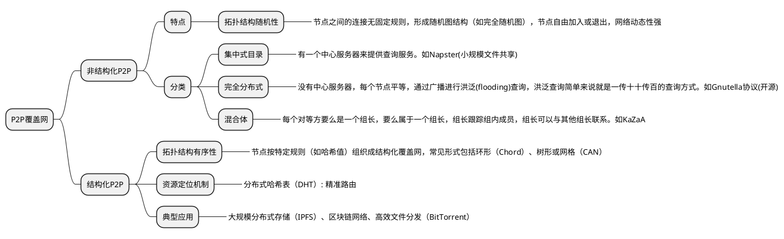

# P2P

当前最流行的P2P文件分发协议是BitTorrent。

## P2P的自扩展性

**一个场景：**  
假设服务器要将一个文件分发给多个用户，  
文件的长度为F，用户数量为N  
$u_s$表示服务器的上传速率   
$u_i$表示第i个用户的上传速率

分发时间(distribution time)是指所有用户得到该文件副本的时间。  

**客户-服务器体系结构下的分发时间**  
* 服务器对每个用户的上传时间为$\frac{F}{u_s}$，N个用户则为$\frac{NF}{u_s}$，所以分发该文件的时间至少为$\frac{NF}{u_s}$  
* 每个用户的下载时间为$\frac{F}{d_i}$，所以所有用户都获得该文件的时间至少为$\frac{F}{d_{min}}$，其中$d_{min}=min\{d_1, d_2, ...d_N\}$  

* 所以C/S结构下的分发时间$D_{cs} 至少为 max\{\frac{NF}{u_s}, \frac{F}{d_{min}}\}$

对于足够大的N，$D_{cs}$由$\frac{NF}{u_s}$决定，所以该分发时间随着用户数量N的增加而线性增加。

**P2P体系结构下的分发时间**  
P2P结构下，每个对等方(用户)都能够帮助服务器分发该文件。当一个对等方接收到数据，它可以自己上传数据分发给其它对等方。  
* 分发的开始，只有服务器有文件，服务器必须上传该文件至少一次(其他对等方会帮忙上传)，所以分发时间至少为$\frac{F}{u_s}$
* 系统总的上传能力(即系统最大的速率)等于服务器上传速率加上所有对等方的上传速率，即$u_{total}=u_s+u_1+u_2+...+u_N$，总共向系统上传的文件大小为NF bit，则分发时间至少为$\frac{NF}{u_s+u_1+....+u_N}$
* 与客户-服务器结构相同，所有用户获得文件的时间至少为$\frac{F}{d_{min}}$

* 所以P2P结构下的分发时间$D_{P2P} 至少为 max\{\frac{F}{u_s}, \frac{F}{d_{min}}, \frac{NF}{u_s+u_1+...+u_N}\}$

$\frac{NF}{u_s+u_1+...+u_N} = \frac{F}{\frac{u_s}{N} + \frac{u_1+...u_n}{N}} = \frac{F}{\frac{u_s}{N} + \bar{u}}$  
当N足够大时，$D_{P2P}=\frac{F}{\bar{u}}$

**C/S和P2P比较**  

 {width="500"}

对于任意数量的对等方，分发时间总是小于$\frac{F}{\bar{u}}$，因此P2P体系结构具有自扩展性。这种自扩展性的直接原因是：对等方即是消费者又是分发者。

## BitTorrent

BitTorrent是一种文件分发P2P协议。  

* 洪流(torrent)  
参与一个特定文件分发的所有对等方集合被称为一个洪流。  
* 文件块(chunk)  
一个洪流中，对等方彼此下载等长度的文件块。典型的块长度为256KB。  
* 追踪器(tracker)  
每个洪流有一个基础设施节点，称为追踪器。一个对等方加入洪流时，它向追踪器注册自己，并周期性的通知追踪器它仍在洪流中。  
追踪器跟踪所有在洪流中的对等方。  
* 邻近对等方   
与对等方建立TCP连接的对等方称为邻近对等方 。
* 种子  
拥有完整文件的对等方称为种子
* torrent文件  
torrent文件中保存着tracker server的信息

一个对等方首次加入洪流时，它没有块，随着时间流逝，它下载了越来越多的块。当它下载块时，它也为其他对等方上传了多个块。  
对等方可以在下载完文件或者没有下载完的情况下随时离开洪流，也可以在之后重新加入洪流。  

**假设Alice为一个新的对等方：**  
Alice加入洪流时，追踪器随机的从洪流中选择一个对等方子集，并将这个子集中的对等方的IP地址发送给Alice。  
Alice持有这个对等方列表，并尝试与列表中的对等方建立并行的TCP连接。成功与Alice建立TCP连接的对等方称为**邻近对等方**。  

每个对等方都有一个来自于文件的文件块子集。不同的对等方有不同的子集。Alice周期性的询问邻近对等方所拥有的文件块子集。Alice根据文件块子集信息需要做出两个决定：  
1. 应该从邻居请求哪些块。  
决定请求哪些块，采用 **最稀缺优先(rarest first)** 技术，其思路是优先请求自己没有的，且在邻居中最少的块。这样最稀缺的块会优先被分发。  

这种算法的目的是均衡每个块在洪流中的数量。  

2. 应该给请求自己的邻居响应哪些块。  
决定响应哪些块，采用 **一报还一报(tit for tat)** 算法，Alice测量从每个邻居接收数据的速率，确定4个最高速率的邻居，优先给速率高的邻居响应数据。  
每过10秒，Alice重新选择4个高速率的邻居。这4个邻居称为 **疏通(unchoked)**。  
每过30秒，Alice将随机的选择一个新的邻居，并对新邻居响应数据。  
除了这5个邻居(4个高速率邻居和1个试探的邻居)，其他邻居都不能从Alice这请求到数据。  

这种算法的效果是对等方能找到彼此协调的邻居来上传数据。  
(**一报还一报** 算法被证实可以被避开)

## DHT(分布式哈希表)

* 覆盖网络（Overlay Network）  
覆盖网络（Overlay Network）是建立在现有物理网络（如互联网）之上的一种逻辑网络层，节点间通过软件定义的虚拟链路连接，不依赖底层物理设备（路由器、交换机等）  

P2P对等方之间组成的网络是覆盖网络。  

DHT是一种数据库，这种数据库记录分布在一个P2P系统的多个对等方上。  
DHT（Distributed Hash Table，分布式哈希表）本身不是单一协议，而是一种分布式存储和寻址的技术架构。  

在P2P系统中的角色:  
* 在BitTorrent等P2P应用中，DHT协议（如Kademlia）用于替代或补充Tracker服务器：  
* 节点加入DHT网络后，通过协议交互获取资源（如磁力链接对应的文件）的位置信息。  
例如，用户下载文件时，客户端通过DHT协议查询infohash（文件唯一标识），找到持有该文件的节点（Peer）列表。