# Web和HTTP

Web（World Wide Web，万维网）的应用层协议是HTTP(HyperText Transfer Protocol, 超文本传输协议)。  

HTTP有两部分组成：HTTP客户端和HTTP服务端。

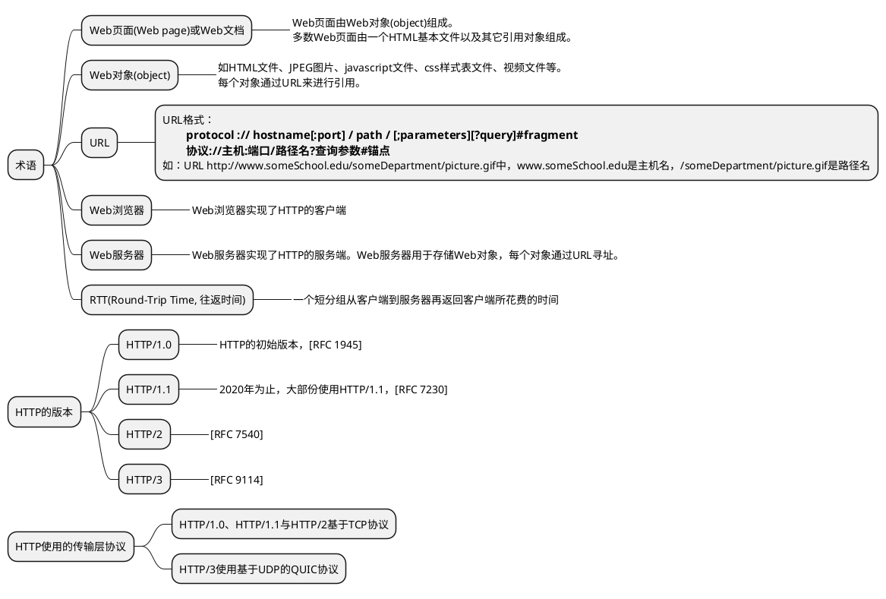

## URI、URL、URN

### URI
URI（Uniform Resource Identifier，统一资源标识符）是一个总称，相当于“资源的身份证号码+住址”。它的作用是唯一标识某个资源，比如一张图片、一本书或一个网页。  

URI组成：

authority由3部分组成：  
* User info：可选，可能包含用户名和密码（可选），由冒号 (:) 分隔，后跟 @ 符号。
* Host：域名或者IP地址。
* Port：指向域或 IP 地址的端口号。

URI举例：
* mailto:hey.john@website.com
* file:website.com/pathtofile/intro.pdf
* https://john@website.com:5052/path/to/page

URI包含两种具体形式：URL(Uniform Resource Locator, 统一资源定位符) 和URN(Uniform Resource Name, 统一资源名称)。  

三者关系：  
* URI = URL + URN：URI是广义的“资源标识”，包含定位（URL）和命名（URN）两种方式。
* URL和URN互补：URL解决“怎么找到资源”，URN解决“怎么唯一标识资源”。
* 实际使用：日常说的“网址”通常是URL，但像磁力链接（如 magnet:?xt=urn:btih:...）则是URN的一种应用。

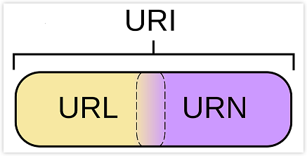

### URL
URL（Uniform Resource Locator，统一资源定位符）是URI的子集，相当于“资源的地址”。它告诉你去哪里能找到这个资源，比如一个具体的网址。  

URL标准格式：  

URL完整格式：  

* scheme：通信协议，包括HTTP、HTTPS、FTP、MAILTO、IRC、FILE等。
* authority包含两部分：  
 
  host：主机，服务器（计算机）域名系统（DNS），主机名或IP地址。  
  port：端口号，可选，省略时是默认端口，如HTTP的默认端口是80，HTTPS 的默认端口是 443。  
* path：路径，用来表示主机上的一个目录或者文件地址。
* query：查询的参数，多个参数由 “&” 隔开，每个参数的名和值用“=”号隔开。如：age=18。
* fragment：信息片段，在给定页面内跳转的目标。

URL举例：  
* http://website.com/path/to/page
* https://website.com/path/here?name=html#head
* http://website.com:5500/path/here

### URN
URN（Uniform Resource Name，统一资源名称）也是URI的子集，相当于“资源的身份证号码”。它只负责给资源一个唯一的名字，不关心资源的位置。  

URN组成：  

* scheme：方案规范（**urn:**）不区分大小写。
* NID：名称空间标识符，可以包括字母、数字和连字符 (-)，后跟冒号 (:)。
* NSS：特定于命名空间的字符串。NSS 可能包含 ASCII 字母、数字、标点符号和特殊字符。

一些特定的NID编号：  

| NID                                             | 含义             |
|-------------------------------------------------|----------------|
| ISBN(International Standard. Books Number)      | 图书的唯一标识符       |
| ISSN(International Standard Serial Number)      | 期刊的唯一标识符       |
| UUID(Universally Unique Identifier)             | 计算机系统内的唯一信息标识符 |
| ISAN(International Standard Audiovisual Number) | 电影等视听作品的唯一编号   |

URL举例：  
* urn:website:language:html:head
* urn:isan:0000-0000-2CEA-0000-1-0000-0000-Y
* urn:ISSN:0167-6423

## HTTP是无状态协议 {id="http_is_stateless_protocol"}

HTTP协议的无状态性是指协议本身不具备记忆能力，
每个请求和响应之间相互独立，服务器不会记录客户端的历史请求信息;

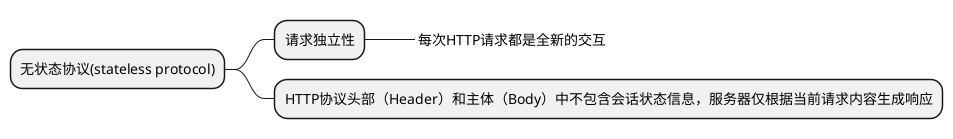

## HTTP连接的持续性{id="http_persistence"}

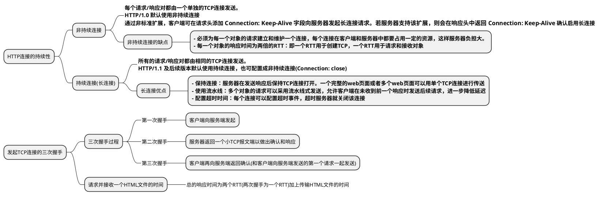

## HTTP报文格式 {id="http_message_format"}

HTTP报文使用ASCII编码

HTTP报文除实体主体(entity body)外由多行组成，每行由一个回车(CR)和换行结束(LF)。  
最后一行之后再附加一个回车换行。

### HTTP请求报文 {id="http_request"}

请求报文的第一行叫做“请求行(request line)”  
请求行后面的行称为“首部行(header line)”  
最后是可选的“实体主体(entity body)“  

HTTP请求报文例子：

HTTP请求报文的通用格式：

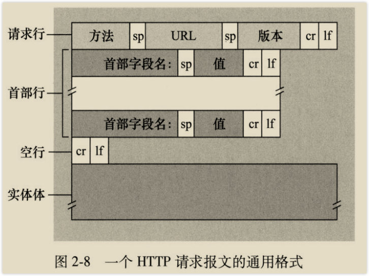 {width="500"}

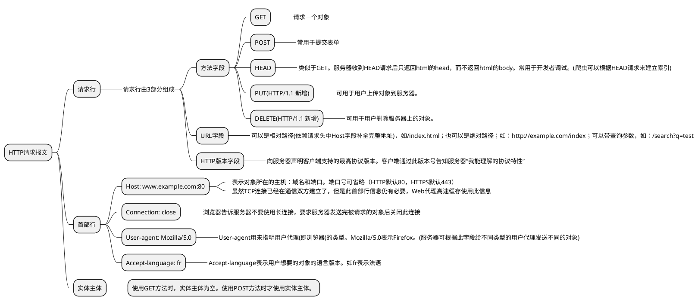

### HTTP响应报文 {id="http_response"}

响应报文的第一行叫做“状态行(status line)”  
状态行后面的行称为“首部行(header line)”  
最后是可选的“实体主体(entity body)“  

HTTP响应报文例子：

HTTP响应报文的通用格式：

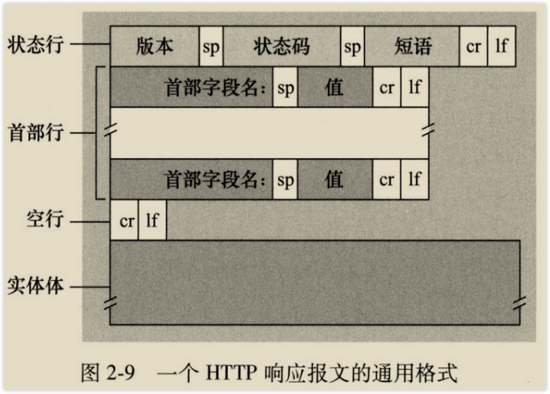 {width="500"}

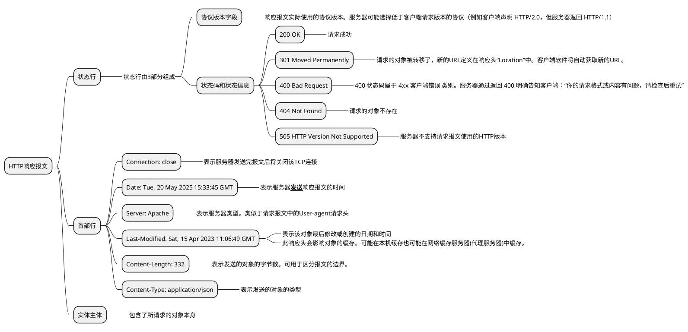

### 实践

使用telnet软件

telnet cis.poly.edu 80  
GET /~ross/ HTTP/1.1  
Host: cis.poly.edu  

## cookie

HTTP设计为无状态协议。  

HTTP可使用cookie来标识用户。  

cookie在用户端(浏览器)可存在一个cookie文件中。在Web服务端可存于数据库中。  

### cookie的产生过程： {id="cookie_generate"}
1. 当客户端（浏览器）首次向服务器发送HTTP请求时，服务器生成一个cookie信息并保存于数据库，通过响应头Set-Cookie字段返回。  
2. 客户端从响应头**Set-cookie**中取出cookie信息，存于本地的cookie文件中。  
3. 客户端下次向服务器发送HTTP请求时，通过请求头**Cookie**字段带上cookie信息，服务端可通过它来识别用户。  

## Web缓存

**Web缓存器(Web cache)** 也叫 **代理服务器(proxy server)**，能够代表原始Web服务器来响应HTTP请求。  
Web缓存器会保存最近请求过的对象副本。可以通过配置浏览器来使得所有HTTP请求都指向Web缓存器。  

### 带Web缓存的请求过程： {id="Web_cache_process"}
1. 浏览器与Web缓存器之间建立TCP连接，并发送HTTP请求
2. Web缓存器检查是否有对象副本。若有，则直接返回该对象；若无，则Web缓存器与原始服务器之间建立TCP连接，并发送HTTP请求。原始服务器收到请求后，返回该对象。
3. Web缓存器收到该对象后，在本地存储一份，并向浏览器发送携带该对象的响应报文(通过原来已建立的TCP连接)。

### 缓存的过期问题-条件GET(conditional GET)

当代理服务器中的缓存过期时，代理服务器需要向原始服务器重新请求新的对象。  
请求报文中若带有If-modified-since请求头，则称这个GET请求为条件GET。  

* 代理服务器在每次收到原始服务器返回的对象后，存储对象副本的同时也会存储对象的“最后修改日期“(响应头Last-Modified中的日期)  
* 代理服务器收到浏览器请求后，向原始服务器发送条件GET，即在请求报文中带上If-modified-since请求头，此请求头的值为上次收到原始服务器响应报文中响应头Last-Modified中的值。  
* 原始服务器收到条件GET请求后，检查对象，若对象有变化则返回新的对象，若没有变化，则返回304状态码表示对象无变化。  

### 因特网上部署了大量的Web代理服务器，有两个好处： {id="proxy_advantage"}
1. 减少客户端的请求响应时间
2. 代理服务器大大减少了因特网上的Web流量，减少了网络负载
3. 减少了Web服务器的负担

举例：  
假设Web缓存服务器的缓存命中率为40%，命中时的总响应时间为10ms，没命中的总响应时间为2.01s，则平均响应时间为0.4 * (0.01s) + 0.6 * 2.01s  

### CDN
因特网中可以设置很多分散的Web缓存服务器，这些服务器共同组成了内容分发网(Content Distribution Network, CDN)。  
CDN分为共享的CDN(如Akamai和Limelight)和专用的CDN(如google和Netflix)。  

## HTTP/2

### HTTP/1.0的问题
* **HTTP/1.0默认使用短连接**  
 
每个对象的请求都需要建立一个新的TCP连接，每个对象都需要两个RTT+对象的传输时间，即n个对象的总时间：n * (2RTT + L/R)。  
解决此**耗时**问题：采用多个并发TCP连接。多个并发的TCP连接导致服务器负担重，一般服务器会限制并发数。

### HTTP/1.1的问题
* **HTTP/1.1默认使用长连接(非流水线)**  
 
一个Web页面可以只使用一个TCP连接。  
HTTP/1.1非流水线情况下，n个对象共需花费：RTT + n * (RTT + L/R)  

* **HTTP/1.1支持长连接+流水线方式(现实未被大规模使用)**  

非流水线情况下，每个对象的请求都必须等待收到上一个对象的响应之后。使用流水线可缩短时间。

* **服务器只能按顺序响应请求(FCFS)**  
* **一个Web页面只使用单一的TCP连接，这种方式存在队头阻塞[Header Of Line (HOL) blocking]问题**
 
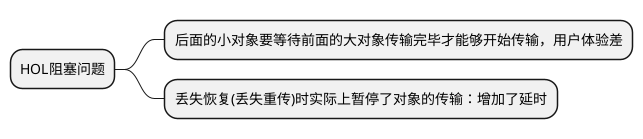

HTTP/1.1解决HOL阻塞问题的典型方法：**使用多个并行的TCP连接。**  

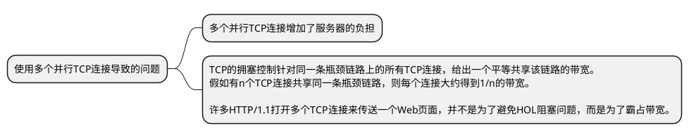

### HTTP/2的改进：HTTP/2的设计目标是减少总延时
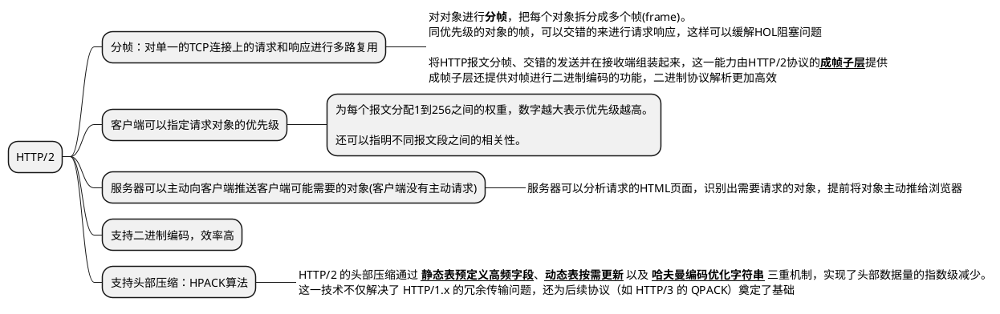

* **HTTP/2没有根本解决HOL阻塞问题**  
 
HTTP/2的分帧使得不同的对象的请求响应可以交错进行，大大缓解了HOL阻塞问题。  
但是由于HTTP/2对所有对象的请求仍然是在同一个TCP连接上进行，所以并没有从根本上解决HOL问题。  

HTTP/2可以和HTTP/1.1一样使用多个并行的TCP连接来缓解HOL阻塞，但是也会带来和HTTP/1.1一样的问题。  

* **HTTP/2不保证安全性**  
 
HTTP/2 不保证安全性，需通过TLS来保证。  
但回带来握手次数多的问题，握手次数：3RTT(1个RTT TCP建立连接，2个RTT TLS握手)

## HTTP/3

HTTP/3 使用新的**QUIC**协议，而不使用TCP。  
QUIC协议在应用层实现，它基于UDP协议。  

* **基于UDP，可以实现连接迁移(TCP无法做到)**

* **使用TLS 1.3(QUIC和TLS是协作关系，而不是包含关系)**

* **组成：HTTP/3 = HTTP/2 + QUIC**

将应用层HTTP/2一些好的功能下移到QUIC上， 如多路复用（同时传多个对象）、对象分帧传输（交错帧）、自定义优先级、二进制传输、头部压缩等  

将部分TCP特性上移到QUIC上， 如TCP的可靠性：流量控制、拥塞控制。  
基于UDP重新高效实现、避免TCP序号二义性  

 {width="350" style="inline"}

 {width="350" style="inline"}

* **HTTP/3协议栈**

QUIC在应用层实现

 {width="400"}

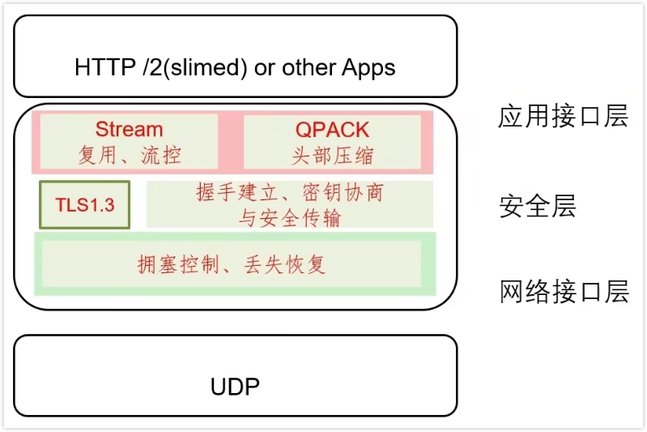 {width="400"}

* **HTTP演化**

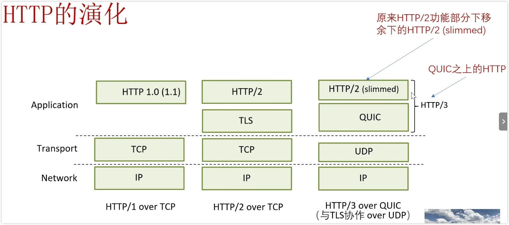 {width="700"}

