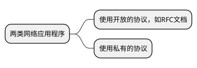
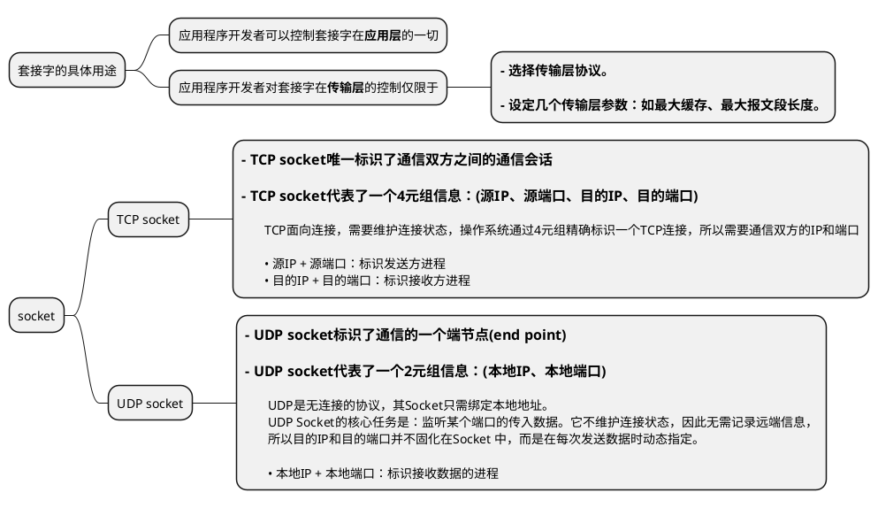

# 套接字编程

典型的网络应用由一对程序组成，即客户端程序和服务端程序。它们位于两个不同的端系统上。  
客户进程和服务器进程通过从套接字读写数据来进行通讯。  



套接字是应用程序和网络之间的API(应用程序编程接口)。  
套接字位于应用层和传输层之间：

不同机器上的进程通过向套接字发送报文来进行通信。  
进程好比是一座房子，进程的套接字好比是门，应用程序位于门内的一侧，传输层位于门外的一侧。  




## UDP套接字编程

一台主机可能运行多个网络应用程序，每个进程可以有多个套接字，当生成一个套接字时，就为套接字分配一个**端口号(port number)**。  

发送进程将数据分组推到套接字前，**若是UDP协议**，则必须先将目的地址附在分组上，目的地址包括**目的主机IP**和**目的主机端口号**。  

发送方的源地址也要附在分组上，源地址包括**源主机IP**和**源主机端口号**。  
将源地址附加在分组上是由操作系统完成的，而不是由应用程序代码完成。  

### UDP socket例子

UDP客户端：
```python
from socket import *

# 可以是服务器的IP或者是主机名(如cis.poly.edu)，若是主机名，则会自动执行DNS lookup从而得到IP地址
serverName = 'localhost'

# 服务器端口
serverPort = 12000

# 创建套接字，AF_INET表示IPV4，SOCK_DGRAM表示UDP套接字
# 注意：创建套接字时，并没有指定客户端的端口号，这个操作由操作系统完成
clientSocket = socket(AF_INET, SOCK_DGRAM)

message = input('Input lowercase sentence:\n')

# sendto方法为报文附加上目的地址(IP和端口)，并向clientSocket发送数据分组（源IP和源端口由操作系统自动完成附加）
# encode()作用是将message字符串转换为字节类型
clientSocket.sendto(message.encode(), (serverName, serverPort))

# 等待接收来自服务器的数据
# modifiedMessage表示接收的数据， serverAddress表示服务器的地址(包括IP和端口)
# 在发送的时候已经知道了服务器的ip和端口，recvfrom仍然会返回服务器的ip和端口，因为udp是无连接的协议，这个socket可以接收任何来源的消息，所以recvfrom返回的服务器地址可以用来校验服务器信息
modifiedMessage, serverAddress = clientSocket.recvfrom(2048)

print(modifiedMessage.decode())

# 关闭套接字
clientSocket.close()
```

UDP服务端：
```python
from socket import *

serverPort = 12000
serverSocket = socket(AF_INET, SOCK_DGRAM)

# 将服务器的套接字与端口serverPort绑定
# 显式的为套接字分配一个端口号，这样向这个端口发送的数据都会被这个套接字接收
serverSocket.bind(('', serverPort))

print('The server is ready to receive')

# while循环使得可以持续接收客户端发送的数据
while True:
    message, clientAddress = serverSocket.recvfrom(2048) # clientAddress是客户端的地址(包括IP和端口)
    modifiedMessage = message.decode().upper() # 将接收的消息转换成大写
    serverSocket.sendto(modifiedMessage.encode(), clientAddress) # sendto方法为报文附加上目的地址(IP和端口)，并将数据分组推到serverSocket（源IP和源端口由操作系统自动完成附加）

```

## TCP套接字编程
