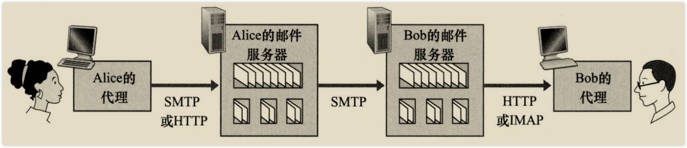
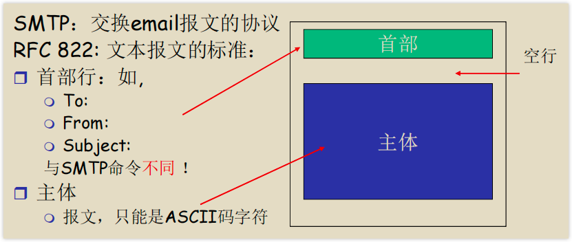
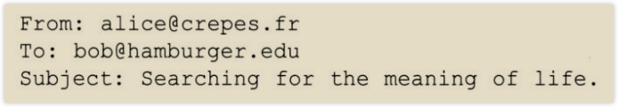
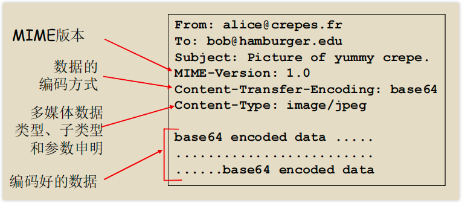

# 电子邮件

电子邮件系统由3部分组成：**用户代理(user agent)**、**邮件服务器(mail server)** 和 **协议** 。  

**用户代理**允许用户处理邮件：阅读、回复、转发、保存、攥写邮件，如Outlook、Gmail。  

每个用户都有一个**邮件服务器**，用户在邮件服务器上有一个邮箱(mailbox)，邮箱管理维护着用户的邮件。邮件服务器中有一个**报文队列**用来保存发送失败的邮件，可以用来在一定时间之后重新尝试发送。  

```plantuml
@startmindmap
!include ../resources/mindmap_style.puml
* 协议
** “推”的协议
*** 简单邮件传输协议(Simple Mail Transfer Protocol, SMTP)、HTTP
** “拉”的协议
*** POP3、IMAP、HTTP
@endmindmap
```

发送邮件的典型过程：



## SMTP(RFC 5321)

### SMTP简介 {id="SMTP_intro"}
SMTP协议**基于TCP协议**。使用**长连接**。  
每个SMTP服务器即是服务端又是客户端。发送邮件时表现为客户端，接收邮件时表现为服务端。  

SMTP协议的RFC可以追溯到1982年，因此带有一些陈旧特征，如**SMTP协议要求报文使用7bit的ASCII码**，二进制多媒体数据必须编码为ASCII码。  

SMTP一般不使用中间服务器发送邮件，即便是两个服务器之间相隔很远(此说法存疑)。  
发送邮件失败时，失败的邮件会保留在发送方的服务器上以便将来重发。而不会保存在“中间服务器”上。  

SMTP的默认服务器端口号为25。  

SMTP握手阶段：SMTP客户端指示发送方和接收方的邮件地址。握手完成之后，开始发送报文。  

### SMTP命令 {id="SMTP_order"}
```plantuml
@startmindmap
!include ../resources/mindmap_style.puml
* SMTP命令
** HELO crepes.fr
** MAIL FROM: <alice@crepes.fr>
** RCPT TO: <bob@hamburger.edu>
** DATA
***_ 表示开始发送**邮件报文**
** .
***_ 表示邮件报文结束
** QUIT
@endmindmap
```

SMTP协议交互例子:   


服务端对每个SMTP命令的响应都以一个回答码和一个可选的英文解释组成。  

SMTP协议使用长连接，在一个连接里可以发送多个邮件报文，对于每个邮件报文，客户端以"MAIL FROM: ..."开始

可以使用"telnet servername 25"命令来实践SMTP协议。  

### 邮件报文

邮件报文由报文首部和报文体组成。  



报文首部由一个个首部行组成。首部行的格式和HTTP头类似：key: value  
报文首部必须包含的首部行："From: "和"To: "。  

一个典型的SMTP报文首部：  



首部行和报文体用一个空行(回车换行)进行分隔。  
  
**MIME(multimedia mail extension, 多媒体邮件扩展)(RFC 2045，RFC 2056)：**  
SMTP协议只能传输ASCII码，可以通过MIME来进行扩展。  
在邮件报文首部可以使用额外的首部行来申明MIME类型。  



## 邮件访问协议
```plantuml
@startmindmap
!include ../resources/mindmap_style.puml
* 邮件访问协议
** POP3(Post Office Protocol)
** IMAP(Internet Mail Access Protocol)
** HTTP
@endmindmap
```
