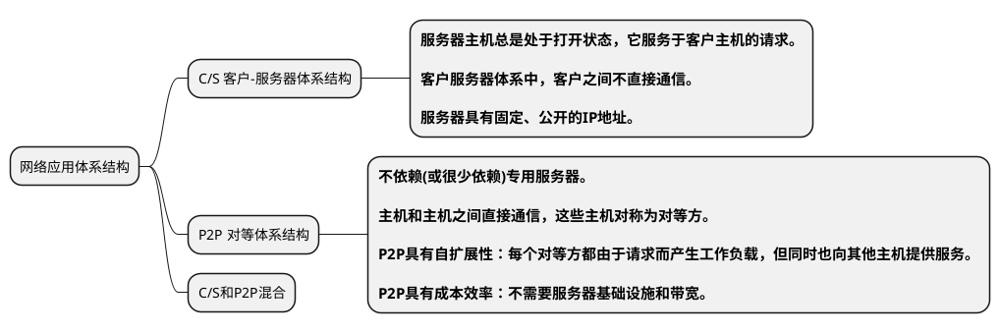
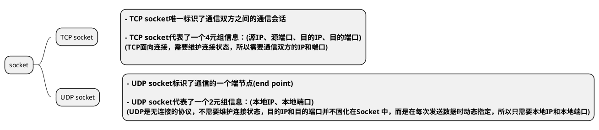
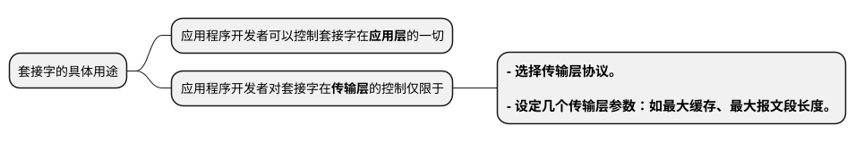
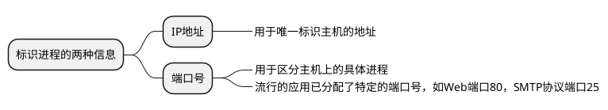
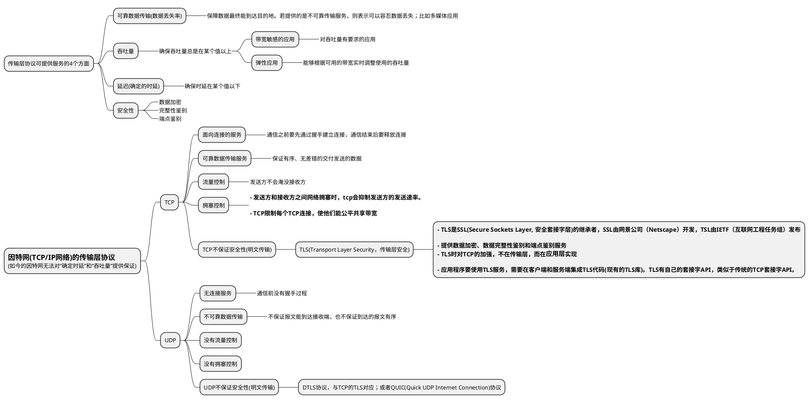
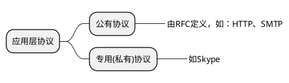

# 网络应用原理

## 网络应用体系结构

## 进程通信

* 网络应用程序  
**网络应用程序**由成对的进程组成，  
端系统之间的通信实际是进程(不同端系统)之间的通信。  

* 客户端和服务端  
网络应用程序由成对的进程组成，这对进程在某个通信会话场景中，发起通信的进程称为**客户**；会话开始后等待联系的进程是**服务器**。  
也可以使用术语“**应用程序**的**客户端**”和“**应用程序**的**服务端**”。  
P2P体系中，每个主机既可以是客户也可以是服务器。

* 套接字  
**套接字**是进程向网络发送和接收报文的软件接口，也称为应用程序和网络之间的API(应用程序编程接口)。 
**套接字**是应用层和传输层之间的接口。  

使用socket API来通信时，socket API会返回一个套接字整数标识(socket)，操作系统使用这个socket整数来标识通信会话。  
就像操作系统打开文件返回的fd(文件描述符或句柄)一样，对fd的操作就是对文件的操作。  
后续可使用这个socket整数来进行通信

* 进程寻址  

## 供应用程序使用的运输服务

## 应用层协议

应用层协议定义了不同端系统上的应用程序进程之间如何进行报文交互。

应用层协议是网络应用的一部分；如：HTTP协议是Web应用的一部分。

